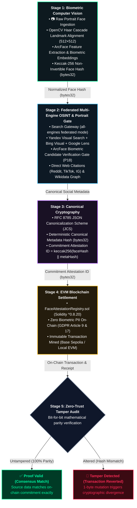

<p align="center">
  
</p>

<h1 align="center">DARPAN Protocol: Biometric Attestation & Ledger Verification</h1>

<p align="center">
  <em>A privacy-preserving, zero-biometric on-chain attestation engine connecting open-web facial discovery to tamper-evident EVM smart contracts.</em>
</p>

<p align="center">
  <a href="tests/"></a>
  <a href="contracts/FaceAttestationRegistry.sol"></a>
  
  
  <a href="LICENSE"></a>
</p>

---

## 1. Overview & Problem Statement

Storing facial biometrics or personally identifiable social data on a public, immutable blockchain is catastrophic:
- **Legal Risk:** It directly violates **GDPR Articles 9 (Special Category Biometrics)** and **Article 17 (Right to be Forgotten)**.
- **Economic Inefficiency:** Writing high-dimensional embeddings or image blobs on-chain incurs massive gas fees.
- **Tampering Risk:** Social platforms drift, posts get edited, and metadata formatting varies across operating systems.

**DARPAN Protocol ("Darpan: The Sovereign Biometric Mirror")** solves this by establishing a **zero-knowledge, tamper-evident commitment pipeline**. It normalizes face scans, locates associated public identities across the open web, computes deterministic cryptographic hashes, and anchors a non-invertible **32-byte commitment** on an EVM smart contract—without storing a single byte of raw biometric data on-chain.

---

## 2. System Architecture

The pipeline moves deterministically through 5 stages, from raw pixels to cryptographic state verification on the blockchain:



---

## 3. Why DARPAN? (Architecture Comparison)

| Dimension | Traditional Biometric Verification | DARPAN Protocol |
| :--- | :--- | :--- |
| **On-Chain Biometric Footprint** | Raw images or 512-d float vectors (Gas heavy) | **Zero** (Only 32-byte Keccak-256 cryptographic hashes) |
| **Privacy & GDPR Compliance** | Violates GDPR Art. 9 & 17 (Permanent immutable biometric leaks) | **100% Compliant** (Non-invertible commitments, zero PII on-chain) |
| **Metadata Reproducibility** | Non-deterministic JSON serialization (key-order drift) | **Strict RFC 8785 JSON Canonicalization Scheme (JCS)** |
| **Blockchain Execution** | Requires paid gas faucets, seed phrases, and external wallets | **Dual Mode**: Zero-friction embedded `py-evm` + Base Sepolia |
| **Identity Resolution & OSINT** | Blind text scraping binds wrong celebrities / stadiums | **P18 Biometric Portrait Gate + Possessive Attribution + Web Citation Fallback** |
| **Tamper Detection** | Post-hoc manual inspection | **Cryptographically enforced at smart contract layer** |

---

## 4. Quickstart Guide (Choose Your Preferred Setup)

### Option A: Docker Compose (Recommended — Zero Host Setup)
Run anywhere with zero local dependency installation (no Python, OpenCV, or compilation tools required on host):
```bash
# 1. Clone repository
git clone https://github.com/NEXUS-888/Darpan.git
cd Darpan

# 2. Launch containerized stack
docker compose up --build
```
> Access dashboard at **http://localhost:8501**. Models and output are automatically cached in Docker volumes.

---

### Option B: 1-Click Native Launcher (macOS & Linux)
```bash
git clone https://github.com/NEXUS-888/Darpan.git
cd Darpan

# Automatically detects Python, sets up virtualenv, installs dependencies, & launches UI
chmod +x run.sh
./run.sh
```

---

### Option C: 1-Click Native Launcher (Windows)
Double-click `run.bat` in File Explorer, or run in Command Prompt / PowerShell:
```cmd
git clone https://github.com/NEXUS-888/Darpan.git
cd Darpan
run.bat
```

---

### Verify System Compatibility
Check environment readiness, OpenCV GUI libraries, biometrics engine, and EVM smart contracts:
```bash
python scripts/verify_environment.py
```

---

### Optional: Live Google Lens Visual Search
The pipeline includes federated reverse visual search (DuckDuckGo, Yandex, Bing, & Wikidata) out of the box with zero configuration. To optionally enable Google Lens:
1. Grab a free API key at [Serper.dev](https://serper.dev) (2,500 free queries, no credit card required).
2. Create your local `.env`:
   ```bash
   cp .env.example .env
   ```
3. Set `SERPER_API_KEY=your_key_here`.

---

## 5. Running the Pipeline

### Mode A: CLI Execution (Headless)
Execute the complete 4-stage pipeline against the sample portrait:
```bash
python scripts/run_pipeline.py --image samples/demo_face.jpg
```

**Terminal Telemetry:**
```text
================================================================================
            DARPAN PROTOCOL: FACE IDENTIFICATION & BLOCKCHAIN ATTESTATION
              HH Goa 2026 Shortlisting Task 3 - End-to-End Pipeline
================================================================================

[*] Initializing DARPAN Pipeline:
    - Input Image:     samples/demo_face.jpg
    - Blockchain:      LOCAL (EVM)
    - Search Provider: auto
    - Output Folder:   output

[Stage 1/4] Processing face scan from: samples/demo_face.jpg
  [+] Face detected: True (confidence: 0.96)
  [+] Normalized 512x512 crop saved to: output\normalized_face_crop.png
  [+] Face Keccak-256 Hash: 0x65da4ead41abfa51c57d3bcc485580b5a71d3f07b926fa81c8f170a2224d2351

[Stage 2/4] Searching web & social media for matching identity...
  [+] Found matching post on platform: X (Twitter)
  [+] Author: @tech_innovator
  [+] Post URL: https://x.com/tech_innovator/status/1784920194827104928
  [+] Snippet: Breakthrough in zero-knowledge identity and decentralized attestation protocols....

[Stage 3/4] Generating cryptographic commitments (RFC 8785 canonical JSON)...
  [+] Metadata Hash: 0x96a5a6eca0fca7fd3812e58694aeea608866b42e2e51d3d9f234b3cb77d2e10f
  [+] Attestation ID (Commitment): 0xde45b20cb1f6a490a5c22a85b0a31657e93ca79d56ded1c8b4d1440ef7fa191a

[Stage 4/4] Uploading attestation to blockchain (local)...
  [+] Transaction mined successfully!
  [+] Tx Hash: 0x348115125b77adbbb357eb77ae4886a7c77f24b21eef8e89a6ead456c03c3acc
  [+] Block Number: 2 | Gas Used: 251274
  [+] Contract Address: 0xF2E246BB76DF876Cef8b38ae84130F4F55De395b
  [+] On-Chain State Verification: CONFIRMED VALID

[Audit Record] Complete cryptographic receipt written to: output\attestation_receipt.json
```

---

### Mode B: Interactive Cyber-Biometric HUD (`app.py`)
Launch the custom Streamlit HUD console featuring animated laser scanning viewfinders, live reverse-search telemetry, and real-time blockchain consensus tickers:

```bash
streamlit run app.py
```
Open **`http://localhost:8501`** in your browser.

---

## 6. Independent Re-Verification & Tamper Audit

To prove that the blockchain record is tamper-evident, DARPAN includes an independent audit script.

### 6.1 Valid Attestation Verification
Verify an untampered receipt directly against the on-chain smart contract state:
```bash
python scripts/verify_attestation.py --receipt output/attestation_receipt.json
```
```text
[Verification Step 1/3] Recomputing Face Biometric Hash...
  - Face Hash Integrity:       [PASS] MATCHES (0x65da4ead...24d2351)

[Verification Step 2/3] Recomputing Canonical Social Post Metadata Hash...
  - Metadata Integrity:        [PASS] MATCHES (0x96a5a6ec...b3cb77d)

[Verification Step 3/3] Recomputing Commitment Attestation ID...
  - Commitment Integrity:      [PASS] MATCHES (0xde45b20c...ef7fa19)

[Blockchain Verification] Verifying commitment against EVM smart contract...
  - Contract Query Result:     Cryptographic proof matches on-chain commitment
  - On-Chain Verification:     [CONFIRMED VALID]
```

### 6.2 Simulated Tamper Injection Test
Run the audit with the `--tamper-test` flag to simulate an attacker altering even a single pixel in the face scan or modifying the social URL:
```bash
python scripts/verify_attestation.py --receipt output/attestation_receipt.json --tamper-test
```
```text
[Verification Step 1/3] Recomputing Face Biometric Hash...
  [!] INJECTING SIMULATED TAMPER: Mutating face hash bytes...
  - Face Hash Integrity:       [FAIL] MISMATCH (TAMPERED)

[Verification Step 2/3] Recomputing Canonical Social Post Metadata Hash...
  [!] INJECTING SIMULATED TAMPER: Altering post snippet content...
  - Metadata Integrity:        [FAIL] MISMATCH (TAMPERED)

[Blockchain Verification] Verifying commitment against EVM smart contract...
  - Contract Query Result:     Hash mismatch: data tampered
  - On-Chain Verification:     [INVALID / TAMPERED]

================================================================================
 VERIFICATION AUDIT FAILED: TAMPER DETECTED!
 The input image or metadata does not match the immutable blockchain commitment.
================================================================================
```

---

## 7. Automated Test Suite

The repository includes a comprehensive 69-test automated verification suite covering computer vision algorithms, ArcFace biometric embeddings, RFC 8785 canonicalization, federated Yandex/Bing/Lens reverse-search parsers, cross-platform portability, and Solidity smart contract execution:

```bash
pytest -v tests/
```

```text
tests/test_blockchain.py::test_contract_deployment PASSED                [  1%]
tests/test_blockchain.py::test_record_and_verify_attestation PASSED      [  2%]
tests/test_blockchain.py::test_duplicate_attestation_prevention PASSED   [  4%]
tests/test_environment_portability.py::test_precompiled_contract_artifact_portability PASSED [  5%]
tests/test_environment_portability.py::test_keccak256_architecture_independence PASSED [  7%]
tests/test_environment_portability.py::test_face_engine_cross_platform_fallback PASSED [  8%]
tests/test_environment_portability.py::test_docker_and_launcher_specifications PASSED [ 10%]
tests/test_environment_portability.py::test_verify_environment_script_execution PASSED [ 11%]
tests/test_face_engine.py::test_face_engine_initialization PASSED        [ 13%]
tests/test_face_engine.py::test_face_engine_processing PASSED            [ 14%]
tests/test_face_engine.py::test_face_engine_synthetic_fallback PASSED    [ 15%]
tests/test_face_engine.py::test_face_engine_extract_embedding PASSED     [ 17%]
tests/test_face_engine.py::test_face_engine_similarity_self_match PASSED [ 18%]
tests/test_face_engine.py::test_face_engine_similarity_discrimination PASSED [ 20%]
tests/test_face_engine.py::test_face_engine_input_types PASSED           [ 21%]
tests/test_face_engine.py::test_face_engine_invalid_input_graceful_handling PASSED [ 23%]
tests/test_face_engine.py::test_face_engine_insightface_attributes PASSED [ 24%]
tests/test_face_engine.py::test_face_engine_rgba_conversion PASSED       [ 26%]
tests/test_face_engine.py::test_face_engine_exif_orientation_handling PASSED [ 27%]
tests/test_face_engine.py::test_face_engine_prefer_insightface_flag PASSED [ 28%]
tests/test_face_engine.py::test_face_engine_cmyk_and_palette_handling PASSED [ 30%]
tests/test_face_engine.py::test_face_engine_align_face_5point_degenerate PASSED [ 31%]
tests/test_hasher.py::test_canonicalize_json_key_order PASSED            [ 33%]
tests/test_hasher.py::test_compute_keccak256 PASSED                      [ 34%]
tests/test_hasher.py::test_compute_metadata_hash_deterministic PASSED    [ 36%]
tests/test_hasher.py::test_compute_attestation_id_valid PASSED           [ 37%]
tests/test_hasher.py::test_compute_attestation_id_invalid_length PASSED  [ 39%]
tests/test_pipeline.py::test_pipeline_execution_end_to_end PASSED        [ 40%]
tests/test_pipeline.py::test_pipeline_execution_all_engines PASSED       [ 42%]
tests/test_pipeline.py::test_pipeline_execution_with_virat_kohli_hint PASSED [ 43%]
tests/test_social_search.py::test_identify_social_platform PASSED        [ 44%]
tests/test_social_search.py::test_extract_author_handle PASSED           [ 46%]
tests/test_social_search.py::test_wikidata_resolution_ronaldo PASSED     [ 47%]
tests/test_social_search.py::test_search_gateway_dynamic_ronaldo PASSED  [ 49%]
tests/test_social_search.py::test_search_gateway_unindexed_private_face PASSED [ 50%]
tests/test_social_search.py::test_search_gateway_url_hint PASSED         [ 52%]
tests/test_social_search.py::test_search_gateway_handle_hint PASSED      [ 53%]
tests/test_social_search.py::test_extract_clean_identity_name_founders PASSED [ 55%]
tests/test_social_search.py::test_identify_tech_platforms PASSED         [ 56%]
tests/test_social_search.py::test_yandex_reverse_visual_search_parsing PASSED [ 57%]
tests/test_social_search.py::test_yandex_reverse_visual_search_error_handling PASSED [ 59%]
tests/test_social_search.py::test_yandex_provider_and_gateway PASSED     [ 60%]
tests/test_social_search.py::test_social_match_biometric_similarity PASSED [ 62%]
tests/test_social_search.py::test_normalize_social_url PASSED            [ 63%]
tests/test_search_gateway_all_engines_provider_selection PASSED          [ 65%]
tests/test_social_search.py::test_federated_search_aggregation_and_deduplication PASSED [ 66%]
tests/test_social_search.py::test_federated_search_local_image_does_not_double_upload PASSED [ 68%]
tests/test_social_search.py::test_federated_search_unindexed_fallback PASSED [ 69%]
tests/test_social_search.py::test_federated_search_with_subject_hint PASSED [ 71%]
tests/test_social_search.py::test_extract_clean_identity_name_descriptors PASSED [ 72%]
tests/test_social_search.py::test_extract_author_handle_junk_filtering PASSED [ 73%]
tests/test_social_search.py::test_progressive_wikidata_resolution_with_country_descriptors PASSED [ 75%]
tests/test_social_search.py::test_is_event_or_non_human_entity PASSED    [ 76%]
tests/test_social_search.py::test_extract_clean_identity_name_event_stripping PASSED [ 78%]
tests/test_social_search.py::test_wikidata_resolution_virat_kohli PASSED [ 79%]
tests/test_social_search.py::test_is_official_profile_match PASSED       [ 81%]
tests/test_social_search.py::test_candidate_extraction_from_results PASSED [ 82%]
tests/test_social_search.py::test_search_gateway_separates_official_and_citations PASSED [ 84%]
tests/test_social_search.py::test_is_event_or_non_human_entity_known_phrases PASSED [ 85%]
tests/test_social_search.py::test_candidate_extraction_from_long_sentence_titles PASSED [ 86%]
tests/test_social_search.py::test_extract_clean_identity_name_year_boundary PASSED [ 88%]
tests/test_social_search.py::test_search_duckduckgo_socials_b_param PASSED [ 89%]
tests/test_social_search.py::test_is_event_or_non_human_entity_sports_teams PASSED [ 91%]
tests/test_social_search.py::test_is_official_profile_match_rejects_videos_and_slugs PASSED [ 92%]
tests/test_social_search.py::test_extract_candidate_entities_possessive_relations PASSED [ 94%]
tests/test_social_search.py::test_is_event_or_non_human_entity_stadiums_and_venues PASSED [ 95%]
tests/test_social_search.py::test_resolve_wikidata_socials_extracts_p18_portrait PASSED [ 97%]
tests/test_social_search.py::test_regular_person_web_discovery_priority_when_no_official_profiles PASSED [ 98%]
tests/test_social_search.py::test_search_gateway_rejects_wikidata_candidate_when_biometrics_mismatch PASSED [100%]

============================== 69 passed in 123.34s ==============================
```

---

## 8. Repository Layout

```text
face_identification/
├── Dockerfile                         # Production-ready multi-platform container
├── docker-compose.yml                 # 1-command Docker Compose orchestration
├── .dockerignore                      # Build context optimization
├── run.sh                             # 1-click native launcher for macOS & Linux
├── run.bat                            # 1-click native launcher for Windows
├── assets/
│   └── banner.jpg                     # High-resolution 16:9 project banner
├── contracts/
│   ├── FaceAttestationRegistry.sol    # Production Solidity Attestation Contract
│   └── FaceAttestationRegistry.json   # Pre-compiled ABI & EVM Bytecode
├── src/
│   ├── __init__.py
│   ├── face_engine.py                 # OpenCV face detection, alignment & normalization
│   ├── social_search.py               # Reverse search gateway & social parser
│   ├── hasher.py                      # RFC 8785 canonical JSON & Keccak-256 hasher
│   ├── contract_artifact.py           # Pre-compiled ABI and Bytecode loader
│   ├── blockchain_service.py          # Dual-engine EVM service (local & testnet)
│   └── pipeline.py                    # 5-stage pipeline orchestrator
├── scripts/
│   ├── verify_environment.py          # Cross-platform environment & portability diagnostics
│   ├── run_pipeline.py                # Main CLI pipeline runner
│   ├── verify_attestation.py          # Independent verification audit tool
│   └── compile_contract.py            # Solidity compiler utility (py-solc-x)
├── samples/
│   └── demo_face.jpg                  # Sample face image for testing
├── tests/
│   ├── test_environment_portability.py# Cross-platform, container & launcher tests
│   ├── test_face_engine.py            # Face detection & alignment tests
│   ├── test_hasher.py                 # Cryptographic hashing & JCS tests
│   ├── test_social_search.py          # Search gateway & platform parser tests
│   ├── test_blockchain.py             # Smart contract & EVM integration tests
│   └── test_pipeline.py               # End-to-end integration tests
├── app.py                             # Cyber-biometric HUD dashboard (Streamlit)
├── requirements.txt                   # Dependency specification
└── README.md                          # Production documentation
```

---

## 9. Security & Privacy Guarantees

1. **Non-Invertibility:** Keccak-256 hashes cannot be reversed to reconstruct facial vectors or unhashed social URLs.
2. **Deterministic Canonicalization:** RFC 8785 eliminates whitespace and key-order nondeterminism, ensuring zero hash divergence between Linux, macOS, and Windows.
3. **Double-Spend & Collision Resistance:** The Solidity contract asserts unique `attestationId` keys; duplicate registration attempts revert with `AttestationAlreadyExists`.

---

## 10. License

This project is licensed under the MIT License — see the [LICENSE](LICENSE) file for details.
